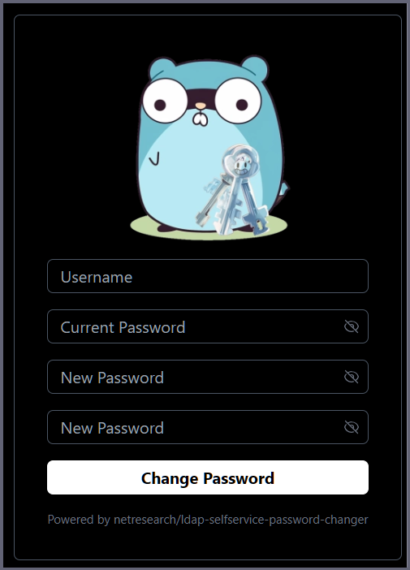
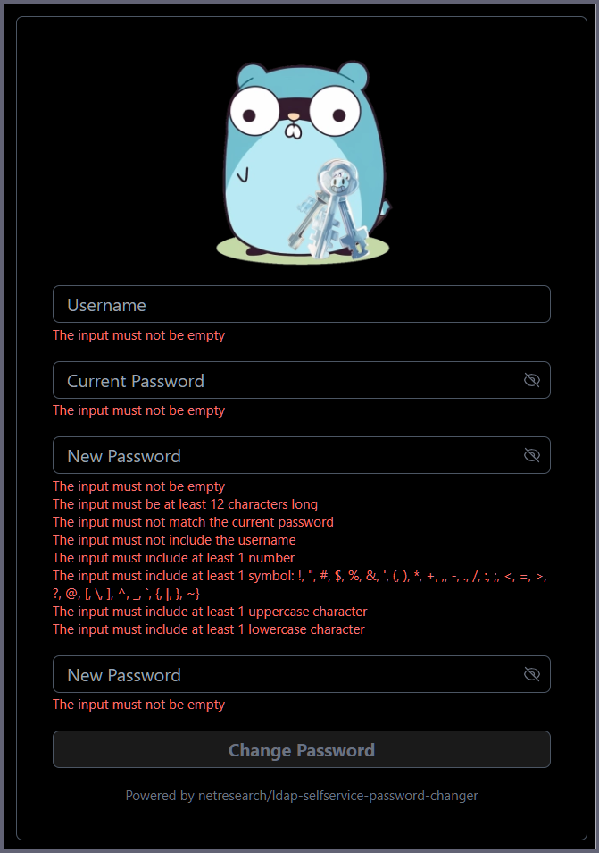

# LDAP Manager

<div align=center>

  

<span>LDAP Manager is a web frontend that allows your users to administrate the their users.</span>

</div>

## Prerequisites

- **Go 1.25.1+** - Backend application language
- **Node.js v22+** - Frontend asset building (Tailwind CSS)
- **pnpm 10.17.1+** - JavaScript package manager (via corepack)
- **Docker with BuildKit** - For containerized deployment (requires `DOCKER_BUILDKIT=1`)
- **Docker Compose v2+** - Modern `docker compose` CLI for local development
- **templ CLI** - Template generation (`go install github.com/a-h/templ/cmd/templ@latest`)

## Running

### Docker Compose (Recommended for Development)

The project includes a complete Docker Compose setup with OpenLDAP server, phpLDAPadmin, and profiles for different environments:

```bash
# Copy environment template
cp .env.example .env

# Build and run development environment (with live reload)
export DOCKER_BUILDKIT=1
docker compose --profile dev build
docker compose --profile dev up

# Run tests in containerized environment
docker compose --profile test up

# Run production build
docker compose --profile prod up
```

**Development Features:**

- 🔄 Live reload - source code mounted at runtime
- 📦 Cache optimization - BuildKit cache mounts for 60% faster builds
- 🏥 Health checks - automatic dependency ordering (LDAP ready before app starts)
- 🔒 Built-in OpenLDAP - pre-configured test server on port 389
- 🌐 phpLDAPadmin - web-based LDAP browser on port 8080

### Natively

If you want to run this service without a Docker container, you have to build it yourself.

Prerequisites: Go 1.25.1+, Node.js v22+, Corepack, templ CLI

You can configure this via a `.env.local` file or via command options (for more information you can run `./ldap-manager --help`).

<!-- Multiline comment idea taken from https://stackoverflow.com/a/12797512 -->

```bash
corepack enable
pnpm i
pnpm build

./ldap-manager \
  `# You can also configure these via environment variables,` \
  `# please see the .env file for available options.` \
  -ldap-server ldaps://dc1.example.com:636 -active-directory \
  -readonly-password readonly -readonly-user readonly \
  -base-dn DC=example,DC=com
```

### Docker (Production)

We publish optimized production images to [GitHub Container Registry](https://github.com/netresearch/ldap-manager/pkgs/container/ldap-manager):

**Image Features:**

- 📦 **13.1MB** - Minimal distroless runtime (70% smaller than Alpine)
- 🛡️ **Security hardened** - Nonroot user (UID 65532), read-only filesystem, no shell
- ⚡ **Fast builds** - BuildKit cache mounts reduce rebuild time by 60%
- 🏷️ **OCI compliant** - Full metadata labels and multi-platform support (amd64, arm64, arm/v7)

<!-- Multiline comment idea taken from https://stackoverflow.com/a/12797512 -->

```bash
docker run \
  `# Run the container detached from the current terminal` \
  -d --name ldap-manager \
  `# You might want to mount your host SSL certificate directory,` \
  `# if you have a self-signed certificate for your LDAPS connection` \
  -v /etc/ssl/certs:/etc/ssl/certs:ro \
  -p 3000:3000 \
  ghcr.io/netresearch/ldap-manager:latest \
  `# You can also configure these via environment variables,` \
  `# please see the .env file for available options.` \
  -ldap-server ldaps://dc1.example.com:636 -active-directory \
  -readonly-password readonly -readonly-user readonly \
  -base-dn DC=example,DC=com
```

**Note:** You can ignore the warning that the service could not load a `.env` file when running in production.

## Screenshot



<br clear="all">

## Documentation

**📌 [Complete Documentation Index](docs/INDEX.md)** - Navigate all documentation with cross-references and quick links

Comprehensive documentation is available in the [`docs/`](docs/) directory:

### For Users

- **[Installation Guide](docs/user-guide/installation.md)** - Setup and deployment instructions
- **[Configuration Reference](docs/user-guide/configuration.md)** - Complete configuration options
- **[API Documentation](docs/user-guide/api.md)** - REST API endpoints and usage

### For Developers

- **[Development Setup](docs/development/setup.md)** - Local development environment
- **[Contributing Guidelines](docs/development/contributing.md)** - Code standards and workflow
- **[Architecture Overview](docs/development/architecture.md)** - System design and patterns

### For Operations

- **[Deployment Guide](docs/operations/deployment.md)** - Production deployment strategies
- **[Monitoring & Troubleshooting](docs/operations/monitoring.md)** - Operational procedures

## Quick Start

### For Users

```bash
# Docker deployment (recommended)
docker run -d --name ldap-manager \
  -e LDAP_SERVER=ldaps://dc1.example.com:636 \
  -e LDAP_BASE_DN="DC=example,DC=com" \
  -e LDAP_READONLY_USER=readonly \
  -e LDAP_READONLY_PASSWORD=password \
  -e LDAP_IS_AD=true \
  -p 3000:3000 \
  ghcr.io/netresearch/ldap-manager:latest
```

### For Developers

```bash
# Setup development environment with Docker Compose
export DOCKER_BUILDKIT=1
cp .env.example .env
docker compose --profile dev up

# Or use Makefile commands
make setup
make dev

# See full development guide: docs/development/setup.md
```

## License

LDAP Manager is licensed under the MIT license, for more information please refer to the [included LICENSE file](LICENSE).

## Contributing

Feel free to contribute by creating a Pull Request!

This project uses [Conventional Commits](https://www.conventionalcommits.org/en/v1.0.0/) for commit messages and the default `gofmt` and `prettier` formatting rules.
