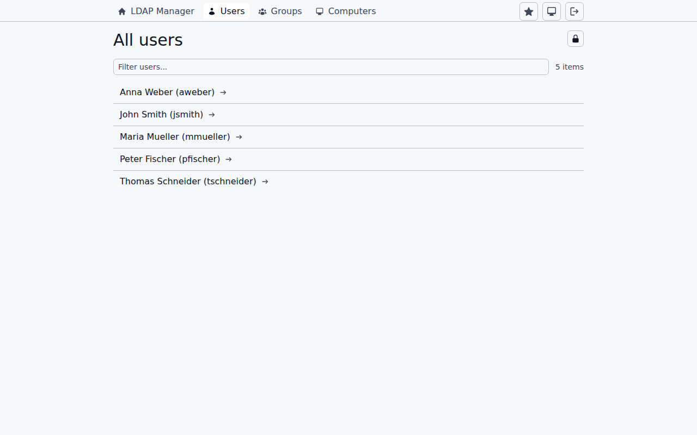
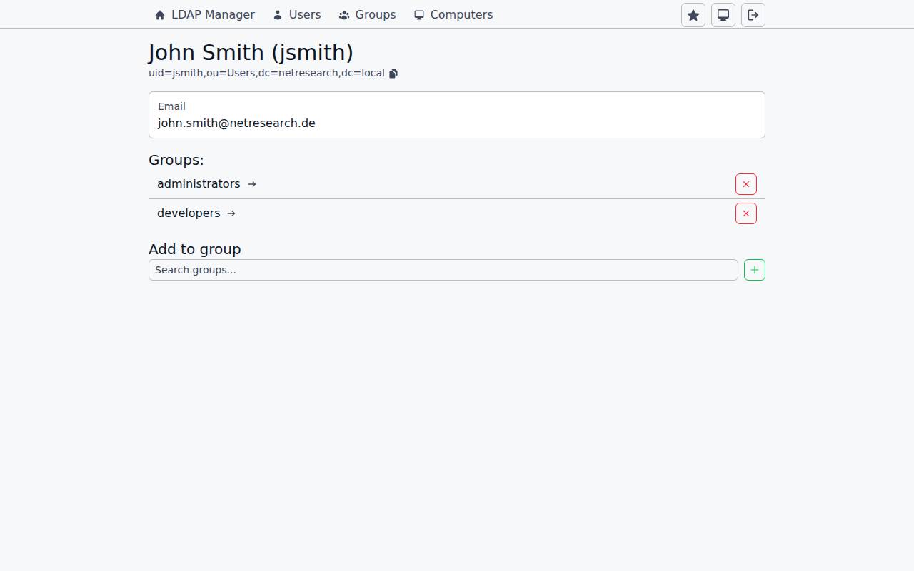
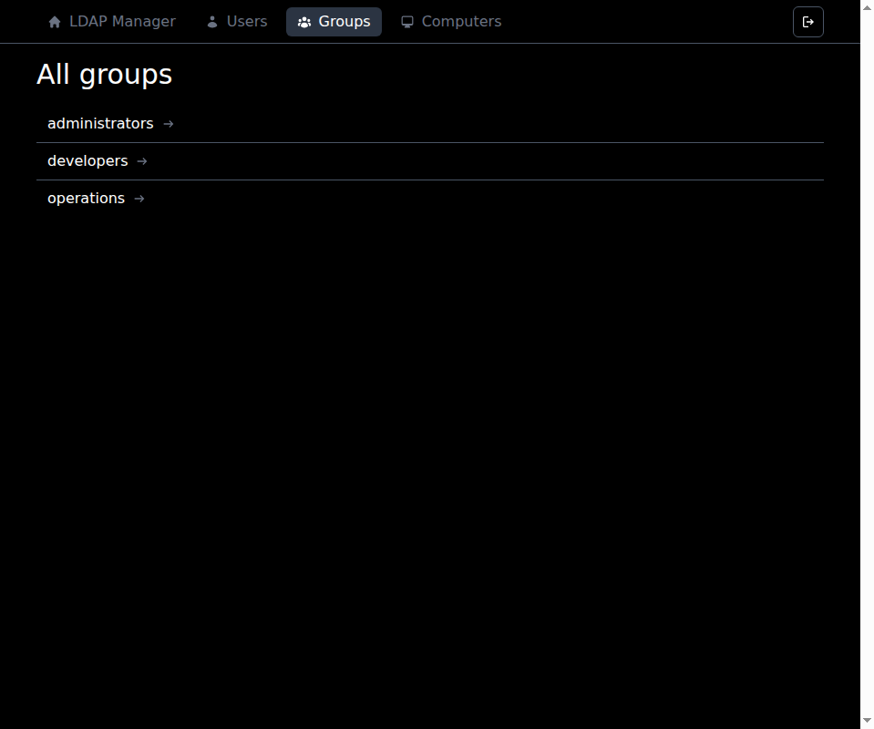
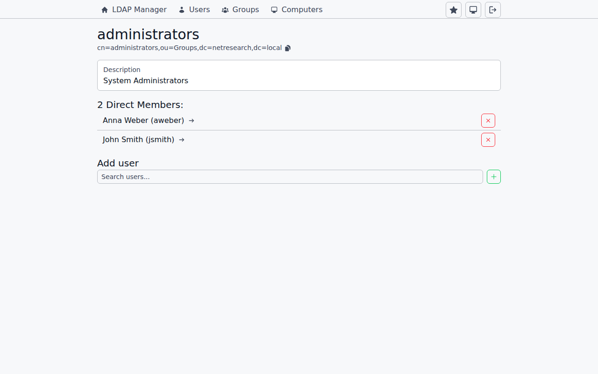

# LDAP Manager

<div align="center">


**Web-based LDAP administration interface for managing users, groups, and computers.**

Supports both Active Directory and OpenLDAP with per-user credential binding.

[](https://github.com/netresearch/ldap-manager/actions/workflows/quality.yml)
[](https://github.com/netresearch/ldap-manager/actions/workflows/docker.yml)
[](https://codecov.io/gh/netresearch/ldap-manager)
[](https://goreportcard.com/report/github.com/netresearch/ldap-manager)
[](LICENSE)
[](go.mod)
[](https://github.com/netresearch/ldap-manager/releases/latest)
[](https://github.com/netresearch/ldap-manager/pkgs/container/ldap-manager)

</div>

## Features

- Browse, search, and filter users, groups, and computers
- View and edit user details, group memberships, and attributes
- Per-user LDAP credential binding (no shared admin account required)
- Active Directory and OpenLDAP support with automatic detection
- Direct-bind authentication fallback for non-person accounts
- Configurable via environment variables or command-line flags
- LDAP connection pooling with health checks
- LRU caching with background refresh
- Distroless Docker image (13 MB, nonroot, read-only filesystem)
- Multi-platform builds (linux/amd64, linux/arm64, darwin, windows)

## Quick Start

### Docker (Recommended)

```bash
docker run -d --name ldap-manager \
  -e LDAP_SERVER=ldaps://dc1.example.com:636 \
  -e LDAP_BASE_DN="DC=example,DC=com" \
  -e LDAP_READONLY_USER=readonly \
  -e LDAP_READONLY_PASSWORD=password \
  -e LDAP_IS_AD=true \
  -p 3000:3000 \
  ghcr.io/netresearch/ldap-manager:latest
```

Open <http://localhost:3000> and log in with your LDAP credentials.

### Docker Compose (Development)

The project includes a complete development environment with OpenLDAP, seed data, ACL configuration, and an nginx TLS reverse proxy:

```bash
docker compose --profile dev up
```

This starts:

- **OpenLDAP** with pre-configured users (`admin/admin`, `jdoe/password`, `jsmith/password`)
- **nginx** TLS reverse proxy on <https://localhost:8443>
- **phpLDAPadmin** on <http://localhost:8080>
- **ldap-manager** with live reload

### Native Build

Prerequisites: Go 1.26+, Node.js v22+, pnpm, [templ CLI](https://github.com/a-h/templ)

```bash
pnpm install && pnpm build
go build -o ldap-manager ./cmd/ldap-manager

./ldap-manager \
  --ldap-server ldaps://dc1.example.com:636 \
  --active-directory \
  --base-dn DC=example,DC=com \
  --readonly-user readonly \
  --readonly-password readonly
```

The server listens on port 3000 by default. Set the `PORT` environment variable to override.

## Configuration

All options can be set via environment variables, a `.env` file, or command-line flags. Run `./ldap-manager --help` for the full list.

| Environment Variable     | Flag                  | Default    | Description                                 |
| ------------------------ | --------------------- | ---------- | ------------------------------------------- |
| `LDAP_SERVER`            | `--ldap-server`       | (required) | LDAP URI (`ldap://` or `ldaps://`)          |
| `LDAP_BASE_DN`           | `--base-dn`           | (required) | Base DN for LDAP searches                   |
| `LDAP_IS_AD`             | `--active-directory`  | `false`    | Enable Active Directory mode                |
| `LDAP_READONLY_USER`     | `--readonly-user`     |            | Service account DN for background cache     |
| `LDAP_READONLY_PASSWORD` | `--readonly-password` |            | Service account password                    |
| `LDAP_TLS_SKIP_VERIFY`   | `--tls-skip-verify`   | `false`    | Skip TLS certificate verification           |
| `PORT`                   |                       | `3000`     | HTTP listen port                            |
| `COOKIE_SECURE`          | `--cookie-secure`     | `true`     | Require HTTPS for cookies                   |
| `PERSIST_SESSIONS`       | `--persist-sessions`  | `false`    | Persist sessions to BoltDB                  |
| `SESSION_DURATION`       | `--session-duration`  | `30m`      | Session lifetime                            |
| `LOG_LEVEL`              | `--log-level`         | `info`     | Log level (trace, debug, info, warn, error) |

When no readonly user is configured, the app uses per-user LDAP credentials for all operations and the background cache is disabled.

### Traefik Integration

For production deployments behind Traefik:

```bash
docker network create traefik

# In .env:
TRAEFIK_ENABLE=true
TRAEFIK_HOST=example.com
# Access: https://ldap-manager.example.com
```

## Screenshots

| Users List                                                                    | User Detail                                                                          |
| ----------------------------------------------------------------------------- | ------------------------------------------------------------------------------------ |
|  |  |

| Groups List                                                                     | Group Detail                                                                           |
| ------------------------------------------------------------------------------- | -------------------------------------------------------------------------------------- |
|  |  |

## Docker Image

Published to [GitHub Container Registry](https://github.com/netresearch/ldap-manager/pkgs/container/ldap-manager):

- **13 MB** distroless runtime (nonroot UID 65532, read-only filesystem, no shell)
- Multi-platform: `linux/amd64`, `linux/arm64`, `linux/arm/v7`
- OCI-compliant labels and health check built in

```bash
docker run -d --name ldap-manager \
  -v /etc/ssl/certs:/etc/ssl/certs:ro -p 3000:3000 \
  ghcr.io/netresearch/ldap-manager:latest \
  --ldap-server ldaps://dc1.example.com:636 \
  --base-dn DC=example,DC=com
```

## Documentation

Full documentation is available in [`docs/`](docs/):

- **[Documentation Index](docs/INDEX.md)** - Complete navigation with cross-references
- **[Installation Guide](docs/user-guide/installation.md)** - Setup and deployment
- **[Configuration Reference](docs/user-guide/configuration.md)** - All options
- **[Architecture Overview](docs/development/architecture.md)** - System design
- **[Development Setup](docs/development/setup.md)** - Local environment
- **[Contributing](docs/development/contributing.md)** - Code standards and workflow

## Contributing

Contributions welcome! Please open a Pull Request.

This project uses [Conventional Commits](https://www.conventionalcommits.org/) and formats code with `gofmt` and `prettier`.

## License

[MIT](LICENSE)
