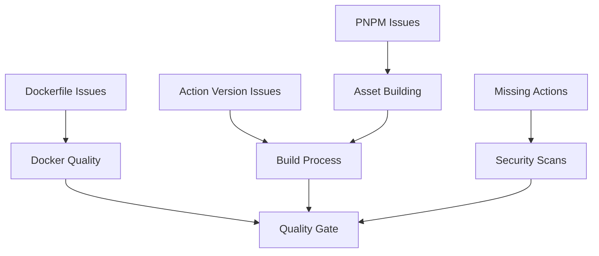

# CI/CD Pipeline Failure Analysis

**Investigation Date**: 2025-09-06  
**Pull Request**: #245 - feat: comprehensive code quality improvements and development infrastructure  
**Branch**: maintenance/general-code-improvements

## Summary of Failures

**CRITICAL ISSUES (Build Blockers)**:
1. Actions version incompatibility (`actions/cache@v5` not found)
2. Missing GitHub action repositories (gosec, nancy)
3. Missing pnpm executable in GitHub Actions runners
4. Dockerfile syntax error (line 51)
5. Missing trivy-results.sarif file

**SECONDARY ISSUES (Quality Gates)**:
- Formatting check failures (due to missing pnpm)
- Build verification failures (due to missing pnpm)
- Dependency analysis failures (due to missing actions)

## Detailed Root Cause Analysis

### 1. Actions Version Compatibility Issues

**Error**: `Unable to resolve action 'actions/cache@v5', unable to find version 'v5'`

**Root Cause**: The workflow is referencing `actions/cache@v5` which doesn't exist yet. The latest version is `v4`.

**Affected Files**: 
- `.github/workflows/docker.yml:47`

**Evidence**: 
```yaml
- name: Cache docker layers
  uses: actions/cache@v5  # ← This version doesn't exist
```

### 2. Missing GitHub Action Repositories

**Error**: `Unable to resolve action securecodewarrior/github-action-gosec, repository not found`

**Root Cause**: The `securecodewarrior/github-action-gosec` repository appears to be missing or moved. Similarly for `sonatypecommunity/nancy-github-action`.

**Affected Files**:
- `.github/workflows/quality.yml:66` (gosec)
- `.github/workflows/quality.yml:287` (nancy)

### 3. Missing PNPM Executable

**Error**: `Unable to locate executable file: pnpm`

**Root Cause**: The workflows are trying to cache pnpm and use it, but pnpm is not installed before attempting to use it with caching.

**Affected Workflows**:
- Build Verification jobs (all platforms)
- Testing & Coverage job
- Check formatting job

**Evidence**: The workflows use `cache: 'pnpm'` in setup-node but pnpm isn't installed first.

### 4. Dockerfile Syntax Error

**Error**: `unexpected '|'expecting '\\', a new line followed by the next instruction`

**Root Cause**: Hadolint detected a syntax error in the Dockerfile at line 51. The HEALTHCHECK command syntax is incorrect.

**Location**: Dockerfile line 50-51
```dockerfile
HEALTHCHECK --interval=30s --timeout=3s --start-period=5s --retries=3 \
  CMD ["/ldap-passwd", "--health-check"] || exit 1
```

The `|| exit 1` syntax is not compatible with the array form of CMD.

### 5. Missing Trivy Results File

**Error**: `Path does not exist: trivy-results.sarif`

**Root Cause**: The trivy scan step creates `trivy-results.sarif` but it's not being generated properly in the docker-quality job because the Docker build likely fails first.

## Impact Assessment

**Build Pipeline**: BLOCKED - Cannot build Docker images or verify builds
**Security Scans**: BLOCKED - Cannot run vulnerability scans  
**Code Quality**: BLOCKED - Cannot run linting and static analysis
**Test Coverage**: BLOCKED - Cannot run tests and generate coverage
**Deployment**: BLOCKED - Quality gate prevents any merges

## Resolution Priority

1. **CRITICAL** (Fix immediately): Action version compatibility
2. **CRITICAL** (Fix immediately): Missing action repositories  
3. **CRITICAL** (Fix immediately): PNPM installation issues
4. **HIGH** (Fix soon): Dockerfile syntax
5. **MEDIUM** (Fix after critical): Missing SARIF files

## Dependencies Between Issues



**Resolution Order**:
1. Fix action versions and missing repositories (enables basic workflow execution)
2. Fix PNPM installation (enables asset building and formatting)
3. Fix Dockerfile syntax (enables Docker quality checks)
4. Verify all workflows pass end-to-end

## Prevention Strategies

1. **Dependency Pinning**: Pin all action versions to specific releases
2. **Alternative Actions**: Use maintained alternatives for deprecated actions
3. **Workflow Testing**: Test workflow changes in feature branches
4. **Local Validation**: Run hadolint and other tools locally before CI