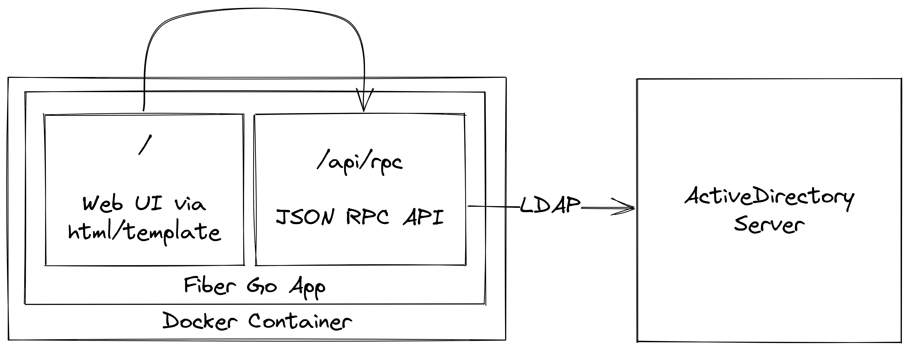
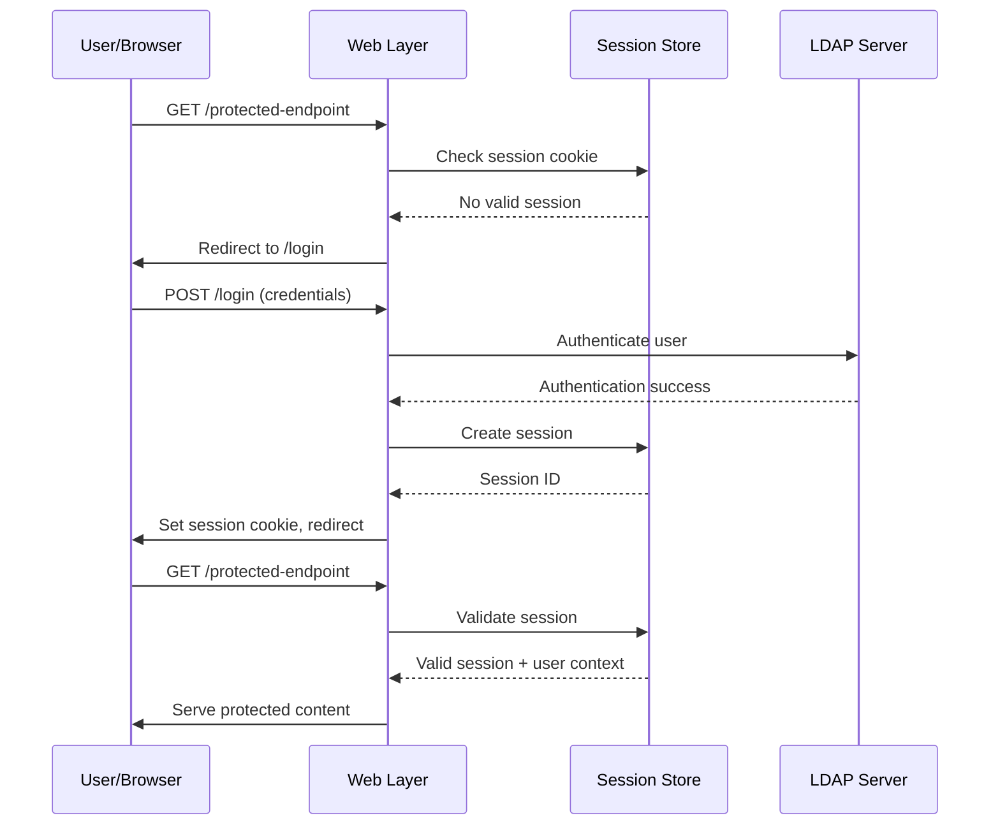
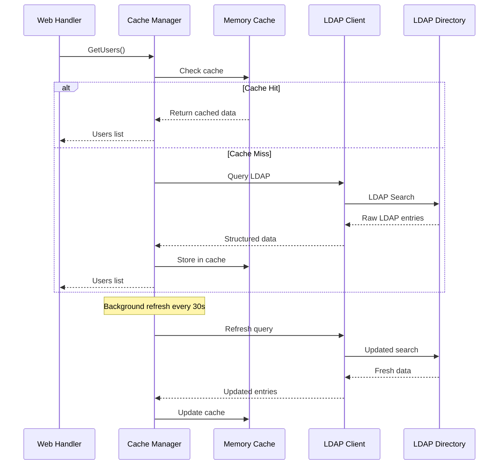

# Architecture Overview

Comprehensive technical architecture documentation for LDAP Manager, covering system design, component interactions, and implementation patterns.

## System Architecture



LDAP Manager follows a layered architecture pattern with clear separation of concerns:

```
┌─────────────────────────────────────────────────┐
│                Web Layer                        │
│  • HTTP Handlers & Routing (Fiber v2)          │
│  • Session Management                           │
│  • Template Rendering (templ)                  │
│  • Static Asset Serving                        │
└─────────────────────────────────────────────────┘
                        │
┌─────────────────────────────────────────────────┐
│              Business Logic Layer               │
│  • LDAP Cache Manager                           │
│  • User/Group/Computer Operations               │
│  • Authentication & Authorization               │
│  • Data Transformation                          │
└─────────────────────────────────────────────────┘
                        │
┌─────────────────────────────────────────────────┐
│               Data Access Layer                 │
│  • LDAP Client Connections                      │
│  • Session Storage (Memory/BBolt)               │
│  • Configuration Management                     │
│  • Logging & Monitoring                         │
└─────────────────────────────────────────────────┘
```

## Component Architecture

### Core Components

#### Web Layer (`internal/web/`)

**Responsibilities:**
- HTTP request routing and handling
- Session-based authentication
- HTML template rendering
- Static asset serving
- Request validation and response formatting

**Key Files:**
- `handlers.go` - Core HTTP handlers
- `users.go` - User management endpoints
- `groups.go` - Group management endpoints  
- `computers.go` - Computer account endpoints
- `middleware.go` - Authentication and logging middleware

**Architecture Pattern:**
```go
type Handler struct {
    cache       *ldap_cache.Manager
    sessions    *sessions.Store
    logger      zerolog.Logger
    templates   *template.Registry
}

func (h *Handler) HandleUserList(c *fiber.Ctx) error {
    // 1. Authenticate user session
    session := h.getSession(c)
    if session == nil {
        return c.Redirect("/login")
    }
    
    // 2. Retrieve data through cache layer
    users, err := h.cache.GetUsers()
    if err != nil {
        return h.renderError(c, err)
    }
    
    // 3. Render template with data
    return c.Render("users/list", fiber.Map{
        "users": users,
        "user":  session.User,
    })
}
```

#### LDAP Cache Layer (`internal/ldap_cache/`)

**Responsibilities:**
- LDAP connection management and pooling
- Directory data caching with automatic refresh
- Query optimization and result transformation
- Error handling and retry logic

**Key Components:**
- `Manager` - Main cache coordination
- `Client` - LDAP connection wrapper
- `Cache` - In-memory data storage with TTL
- `Filters` - Data filtering and search functionality

**Caching Strategy:**
```go
type Manager struct {
    cache       *Cache
    ldapClient  LDAPClient
    refreshChan chan struct{}
    logger      zerolog.Logger
    mu          sync.RWMutex
}

// Automatic refresh every 30 seconds
func (m *Manager) startRefreshLoop() {
    ticker := time.NewTicker(30 * time.Second)
    for {
        select {
        case <-ticker.C:
            m.refreshCache()
        case <-m.refreshChan:
            return
        }
    }
}
```

#### Configuration Management (`internal/options/`)

**Responsibilities:**
- Environment variable and CLI flag parsing
- Configuration validation and defaults
- Secure credential handling
- Runtime configuration access

**Configuration Sources (by priority):**
1. Command-line flags (highest)
2. Environment variables
3. `.env.local` file
4. `.env` file
5. Default values (lowest)

```go
type Options struct {
    LdapServer          string        `env:"LDAP_SERVER"`
    LdapBaseDN          string        `env:"LDAP_BASE_DN"`
    LdapReadonlyUser    string        `env:"LDAP_READONLY_USER"`
    LdapReadonlyPassword string       `env:"LDAP_READONLY_PASSWORD"`
    LdapIsAD            bool          `env:"LDAP_IS_AD"`
    LogLevel            string        `env:"LOG_LEVEL" default:"info"`
    SessionDuration     time.Duration `env:"SESSION_DURATION" default:"30m"`
    PersistSessions     bool          `env:"PERSIST_SESSIONS"`
}
```

## Data Flow Architecture

### Authentication Flow



### LDAP Data Flow



## Security Architecture

### Authentication & Session Management

**Session Security:**
- HTTP-only cookies (XSS protection)
- SameSite=Strict (CSRF protection)
- Configurable expiration (default 30 minutes)
- Secure storage options (Memory or encrypted BBolt)

**LDAP Security:**
- User-context operations (no privilege escalation)
- Connection pooling with credential isolation
- Support for LDAPS (required for Active Directory)
- Service account with minimal permissions

```go
type SessionData struct {
    UserDN    string    `json:"user_dn"`
    Username  string    `json:"username"`
    CreatedAt time.Time `json:"created_at"`
    LastSeen  time.Time `json:"last_seen"`
}

// Each user session maintains separate LDAP context
func (m *Manager) GetClientForUser(userDN, password string) *ldap.Client {
    return &ldap.Client{
        conn:     m.dial(),
        userDN:   userDN,
        password: password,
    }
}
```

### Input Validation & Sanitization

**Form Input Validation:**
```go
func validateUserInput(form map[string]string) error {
    for field, value := range form {
        // Sanitize LDAP injection attempts
        if containsLDAPMeta(value) {
            return fmt.Errorf("invalid characters in %s", field)
        }
        
        // Validate field-specific formats
        if field == "mail" && !isValidEmail(value) {
            return fmt.Errorf("invalid email format")
        }
    }
    return nil
}
```

**LDAP Query Protection:**
```go
func escapeLDAPFilter(input string) string {
    // Escape LDAP special characters
    replacer := strings.NewReplacer(
        "\\", "\\5c",
        "*", "\\2a",
        "(", "\\28",
        ")", "\\29",
        "\x00", "\\00",
    )
    return replacer.Replace(input)
}
```

## Performance Architecture

### Caching Strategy

**Multi-Level Caching:**
1. **Application Cache**: In-memory with 30-second TTL
2. **Connection Pool**: Reuse LDAP connections
3. **Template Cache**: Compiled templates cached in memory
4. **Static Assets**: Browser caching with max-age headers

**Cache Invalidation:**
```go
type Cache struct {
    users     []User
    groups    []Group
    computers []Computer
    lastUpdate time.Time
    mu        sync.RWMutex
}

func (c *Cache) IsExpired() bool {
    return time.Since(c.lastUpdate) > 30*time.Second
}

func (c *Cache) Refresh(newData CacheData) {
    c.mu.Lock()
    defer c.mu.Unlock()
    
    c.users = newData.Users
    c.groups = newData.Groups
    c.computers = newData.Computers
    c.lastUpdate = time.Now()
}
```

### Connection Management

**LDAP Connection Pooling:**
```go
type ConnectionPool struct {
    connections chan *ldap.Conn
    factory     func() (*ldap.Conn, error)
    maxSize     int
}

func (p *ConnectionPool) Get() (*ldap.Conn, error) {
    select {
    case conn := <-p.connections:
        if conn.IsClosing() {
            return p.factory()
        }
        return conn, nil
    default:
        return p.factory()
    }
}
```

**Resource Management:**
```go
// Automatic cleanup with context cancellation
func (m *Manager) processWithTimeout(fn func() error) error {
    ctx, cancel := context.WithTimeout(context.Background(), 30*time.Second)
    defer cancel()
    
    done := make(chan error, 1)
    go func() {
        done <- fn()
    }()
    
    select {
    case err := <-done:
        return err
    case <-ctx.Done():
        return fmt.Errorf("operation timeout: %w", ctx.Err())
    }
}
```

## Concurrency Architecture

### Thread Safety

**Cache Concurrent Access:**
```go
type SafeCache struct {
    data map[string]interface{}
    mu   sync.RWMutex
}

func (c *SafeCache) Get(key string) (interface{}, bool) {
    c.mu.RLock()
    defer c.mu.RUnlock()
    value, exists := c.data[key]
    return value, exists
}

func (c *SafeCache) Set(key string, value interface{}) {
    c.mu.Lock()
    defer c.mu.Unlock()
    c.data[key] = value
}
```

**Background Processing:**
```go
// Goroutine-safe cache refresh
func (m *Manager) startBackgroundRefresh() {
    go func() {
        ticker := time.NewTicker(30 * time.Second)
        defer ticker.Stop()
        
        for {
            select {
            case <-ticker.C:
                if err := m.refreshCacheData(); err != nil {
                    m.logger.Error().Err(err).Msg("cache refresh failed")
                }
            case <-m.stopChan:
                return
            }
        }
    }()
}
```

## Template Architecture

### Type-Safe Templates (templ)

**Template Component System:**
```html
<!-- Base layout -->
templ Layout(title string, content templ.Component) {
<!DOCTYPE html>
<html lang="en">
<head>
    <title>{ title } - LDAP Manager</title>
    <link rel="stylesheet" href="/static/styles.css">
</head>
<body class="bg-gray-100">
    <nav class="bg-blue-600 text-white p-4">
        <!-- Navigation content -->
    </nav>
    
    <main class="container mx-auto p-6">
        @content
    </main>
</body>
</html>
}

<!-- User list component -->
templ UserList(users []User) {
    <div class="grid gap-4">
        for _, user := range users {
            <div class="bg-white p-4 rounded shadow">
                <h3>{ user.DisplayName }</h3>
                <p>{ user.Email }</p>
            </div>
        }
    </div>
}

<!-- Composed page -->
templ UsersPage(users []User) {
    @Layout("Users", UserList(users))
}
```

**Template Safety Features:**
- Compile-time type checking
- Automatic HTML escaping
- XSS protection
- Performance optimization

## Build Architecture

### Asset Pipeline

**Multi-Stage Build Process:**
```makefile
# Stage 1: Frontend assets
css-build:
    tailwindcss -i internal/web/static/input.css -o internal/web/static/styles.css --minify

templ-build:
    templ generate

# Stage 2: Go compilation
go-build: css-build templ-build
    go build -ldflags="-X 'internal.Version=${VERSION}'" -o ldap-manager cmd/ldap-manager/main.go

# Stage 3: Docker image
docker-build:
    docker build -t ldap-manager:latest .
```

**Development vs Production:**

| Aspect | Development | Production |
|--------|-------------|------------|
| CSS | Unminified, source maps | Minified, purged |
| Templates | Hot reload | Pre-compiled |
| Go binary | Debug symbols | Optimized, stripped |
| Logging | Debug level | Info/warn level |
| Assets | Live compilation | Embedded in binary |

## Error Handling Architecture

### Error Types & Handling

**Structured Error Types:**
```go
type LDAPError struct {
    Operation string
    DN        string
    Err       error
}

func (e *LDAPError) Error() string {
    return fmt.Sprintf("LDAP %s failed for %s: %v", e.Operation, e.DN, e.Err)
}

type ValidationError struct {
    Field   string
    Value   string
    Reason  string
}

func (e *ValidationError) Error() string {
    return fmt.Sprintf("validation failed for %s='%s': %s", e.Field, e.Value, e.Reason)
}
```

**Error Recovery Patterns:**
```go
func (h *Handler) HandleWithRecovery(c *fiber.Ctx) error {
    defer func() {
        if r := recover(); r != nil {
            h.logger.Error().
                Interface("panic", r).
                Str("path", c.Path()).
                Msg("handler panic recovered")
            
            c.Status(500).Render("error", fiber.Map{
                "error": "Internal server error",
            })
        }
    }()
    
    return h.actualHandler(c)
}
```

## Monitoring & Observability

### Logging Architecture

**Structured Logging with Zerolog:**
```go
type LogContext struct {
    RequestID string
    UserDN    string
    Operation string
    Duration  time.Duration
}

func (h *Handler) logRequest(ctx LogContext, err error) {
    event := h.logger.Info()
    if err != nil {
        event = h.logger.Error().Err(err)
    }
    
    event.
        Str("request_id", ctx.RequestID).
        Str("user_dn", ctx.UserDN).
        Str("operation", ctx.Operation).
        Dur("duration", ctx.Duration).
        Msg("request completed")
}
```

**Performance Metrics:**
```go
func (m *Manager) trackOperation(name string, fn func() error) error {
    start := time.Now()
    err := fn()
    duration := time.Since(start)
    
    m.logger.Debug().
        Str("operation", name).
        Dur("duration", duration).
        Bool("success", err == nil).
        Msg("operation completed")
    
    return err
}
```

## Deployment Architecture

### Container Strategy

**Multi-Stage Dockerfile:**
```dockerfile
# Build stage
FROM golang:1.23-alpine AS builder
WORKDIR /build
COPY . .
RUN make build-release

# Runtime stage  
FROM alpine:latest
RUN apk --no-cache add ca-certificates tzdata
WORKDIR /app
COPY --from=builder /build/ldap-manager ./
EXPOSE 3000
CMD ["./ldap-manager"]
```

**Configuration Management:**
- Environment variables for runtime config
- Volume mounts for persistent session data
- ConfigMaps/Secrets for Kubernetes deployments

### Scalability Considerations

**Horizontal Scaling:**
- Stateless application design
- External session storage (BBolt database)
- Load balancer session affinity (if using memory sessions)

**Vertical Scaling:**
- Configurable connection pool sizes
- Memory cache size optimization
- Resource limits and requests

This architecture provides a solid foundation for a secure, performant, and maintainable LDAP directory management system. The modular design allows for easy testing, enhancement, and scaling as requirements evolve.